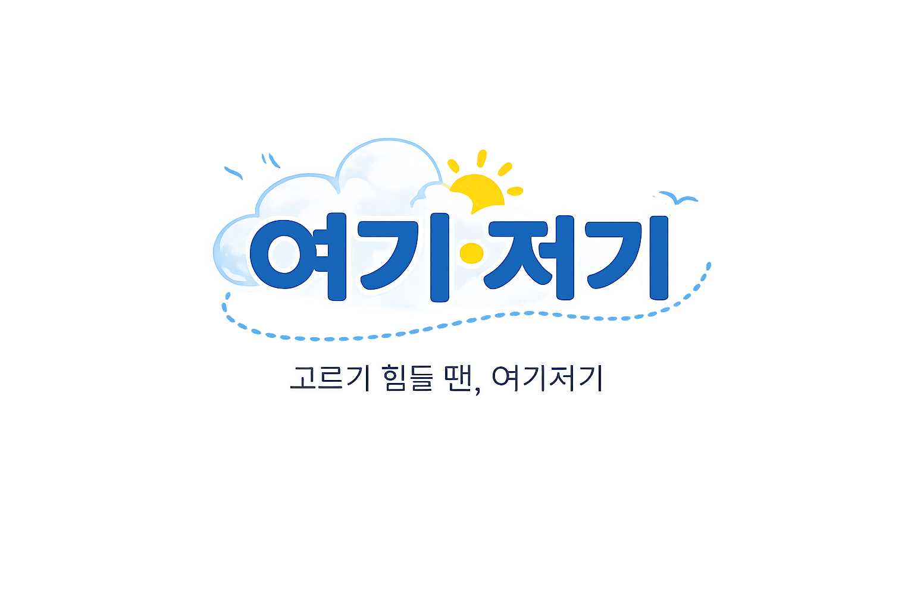
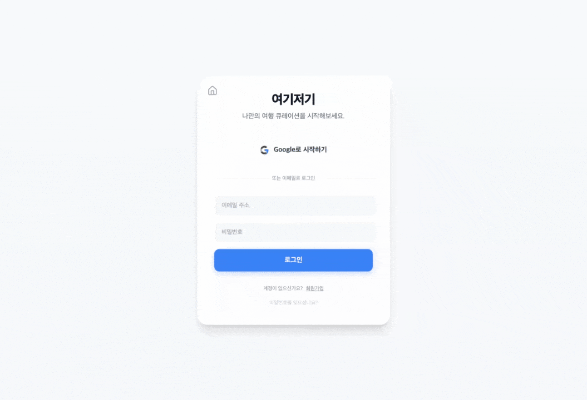
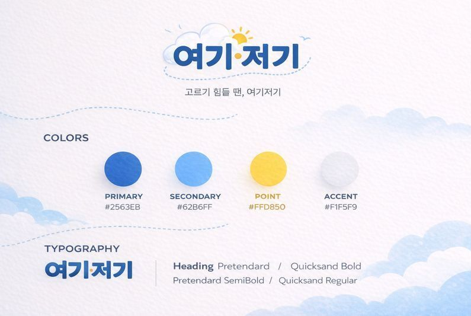

<h1 align="center"> 어디로 가야할지 막막할땐? 여기저기! </h1>



<h3 align="center"> 태그 선택만으로 개인 맞춤 여행지를 추천해주는, AI 기반 여행 계획 플랫폼. </h3>

<h2 align="center"> 🦖 프로젝트 소개 </h2> 
<p align="center">
  여행 정보는 넘치지만, 어디를 가야 할지 결정하기는 점점 어려워지고 있습니다.  <br/>
  ‘여기저기’는 막막한 여행 계획 과정을 **태그 선택과 AI 추천**으로 단순화하여, <br /> 
  <strong>누구나 부담 없이 여행을 시작할 수 있도록 돕는 서비스입니다.</strong>
  <br />
  <br />
  <br />
  개발 기간 : 2026.01.23 ~ 2026.01.29 (7일)
  <br />
  <br />
  <a href="https://suno.com/s/s4zLD41etWcHTiw7">▶️ Suno에서 듣기</a>
  <br />
  본 프로젝트의 분위기를 표현한 AI 생성 테마곡입니다.  
</p>


<h2 align="center"> 📽️ 주요 기능 </h2>

<div align="center">

|    기능     |                         설명                          |
| :---------: | :---------------------------------------------------: |
|   AI 추천   |  Gemini 기반 챗봇으로 여행지를 추천받을 수 있습니다.  |
|    룰렛     |                   여행지 추천 룰렛                    |
|  일정 관리  |       여행 일정을 생성하고, 관리할 수 있습니다.       |
|  후기 작성  |  지난 여행의 후기를 작성해보고, 관리할 수 있습니다.   |
|    지도     |     원하는 여행지의 경로를 안내받을 수 있습니다.      |
| 태그 필터링 | 태그를 통해 검색을 좀 더 원활하게 진행할 수 있습니다. |

</div>

<h2 align="center"> 📽️ 세부 기능 </h2>

<h3 align="center"> 📽️ 소셜 로그인 </h3>
<div align="center">

  
> Google 로그인 / 이메일 회원가입 기능

</div>

<h3 align="center"> 📽️ 마이 페이지 </h3>
<div align="center">

  
> 일정을 관리하고, 커스터마이징 하는 기능

</div>


<h2 align="center"> 🔧 기술 </h2>
<p align="center">
  
  
  
  
  <br />
  <br />
  
  
  
  
</p><br />
<h4 align="center">🛠️ AI</h4> 
<p align="center">
  
  
  
  
  
</p><br />

<h2 align="center"> 📂 폴더 구조 </h2>

~~~text
```
.
└── 📦 여기저기!/
    ├── 📂 Ai/
    │   ├── Aichatbot.css              # 챗봇 css
    │   ├── AiChatbot.html             # 챗봇 페이지
    │   ├── AIchatbot.js               # 챗봇 로직
    │   ├── Aiflot.css                 # 메인페이지 챗봇 css
    │   └── Aiflot.js                  # 메인페이지 챗봇 로직
    ├── 📂 css/
    │   ├── article.css                # 아티클 페이지 css
    │   ├── auth.css                   # 로그인/회원가입 페이지 css
    │   ├── global.css                 # 공통으로 쓰는 css
    │   ├── index.css                  # 메인페이지 css
    │   ├── map.css                    # 지도 css
    │   ├── mypage.css                 # 마이페이지 css
    │   └── roulette.css               # 룰렛 css
    ├── 📂 html/
    │   ├── article.html               # 아티클 페이지
    │   ├── favorites.html             # 찜하기 목록
    │   ├── index.html                 # 메인페이지
    │   ├── map.html                   # 지도
    │   ├── roulette.html              # 룰렛
    │   ├── mypage.html                # 마이페이지
    │   ├── login.html                 # 로그인
    │   ├── resetPassword.html         # 비밀번호 초기화
    │   └── forgotPassword.html        # 비밀번호 찾기
    └── 📂 js/
        ├── data.js                    # 아티클, 리뷰 정보, 좌표 등
        ├── map.js                     # 지도 로직
        ├── roulette.js                # 룰렛 로직
        └── script.js                  # 네비게이션, UI 인터렉션/
                                       ## 인증 및 커스텀 모달 시스템
                                       ## 찜하기, 상세페이지 UI, 토스트 알림
                                       ## 카드 렌더링, 필터/검색 통합 로직
                                       ## 검색창 태그 관리 & 필터 제어
```
~~~

<h2 align="center"> 🎨 컬러 </h2>

- 컬러 팔레트
  
  
  
  - PRIMARY ( 주요 강조 ) : 신뢰감을 주는 진한 블루
    - 핵심 액션 ( 로그인, 시작하기, 계획 완료 )
  - SECONDARY ( 보조 강조 ) : 청량한 스카이 블루
    - 보조 액션 ( 인증요청, 필터선택, 자세히보기 )
  - POINT ( 주의 / 포인트 ) : 따뜻한 옐로우
    - 경고 / 초기화
  - ACCENT ( 배경 / 중립 ) : 연한 그레이 / 화이트톤

<h2 align="center"> 🗂️ 서비스 이용 및 시연 영상 </h2>

- 웹사이트 바로가기 - [여기저기!](https://prgrms-aibe-devcourse.github.io/AIBE5_Project1_Team3/t3Project/html/index.html)
- 프레젠테이션 - [여기저기-PPT](https://www.miricanvas.com/v2/design2/v/7a46caab-c4fb-450b-a81a-32586ce98cc7)
- 시연 영상 보기 - ( 유튜브 링크 예정 있으면 추가 )

<h2 align="center"> 🦖 About "Team 박치기공룡"  </h2>

| 류태우                                                       | 이소연                                                       | 이석민                                                       | 김세준                                                       | 최준영                                                       | 신문규                                                       | 표지민                                                       | 홍가현                                                       |
| ------------------------------------------------------------ | ------------------------------------------------------------ | ------------------------------------------------------------ | ------------------------------------------------------------ | ------------------------------------------------------------ | ------------------------------------------------------------ | ------------------------------------------------------------ | ------------------------------------------------------------ |
|  |  |  |  |  |  |  |  |
| [@taeaeuu](https://github.com/taeaeuu)                       | [@noeyoseel](https://github.com/noeyoseel)                   | [@seokminseok](https://github.com/seokminseok)               | [@warcat12](https://github.com/warcat12)                     | [@jychoi0831](https://github.com/jychoi0831)                 | [@gyu98-mun](https://github.com/gyu98-mun)                   | [@JIMIN-1211](https://github.com/JIMIN-1211)                 | [@devken65](https://github.com/devken65)                     |
| 🧠 팀장 /아티클                                               | ✏️ 마이페이지                                                 | 🏠 메인페이지                                                 | 🗺️ 지도 / 룰렛                                                | 🧠 PM / 아티클                                                | 🗣️ AI 챗봇                                                    | 🔐 로그인 /회원가입                                           | ⚓️ 아티클                                                     |
